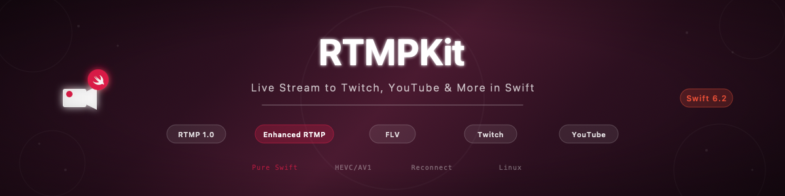

# swift-rtmp-kit

[](https://github.com/atelier-socle/swift-rtmp-kit/actions/workflows/ci.yml)
[](https://codecov.io/github/atelier-socle/swift-rtmp-kit)
[](https://atelier-socle.github.io/swift-rtmp-kit/documentation/rtmpkit/)


[](LICENSE)



Pure Swift RTMP publish client for live streaming to Twitch, YouTube, Facebook, Kick, and any RTMP server. Enhanced RTMP v2 support with FourCC codec negotiation for HEVC, AV1, VP9, and Opus. Zero dependencies on the core target. Strict `Sendable` conformance throughout. Part of the [Atelier Socle](https://www.atelier-socle.com) streaming ecosystem.

---

## Features

- **Full RTMP 1.0 protocol** — Handshake (C0/C1/C2), chunk stream multiplexing, AMF0 commands, FLV packaging
- **Enhanced RTMP v2** — FourCC codec negotiation for HEVC, AV1, VP9, Opus, FLAC, AC-3, and E-AC-3
- **FLV packaging** — Audio tags (AAC sequence headers, raw frames), video tags (AVC NALUs, keyframes), script data
- **Platform presets** — One-line configuration for Twitch, YouTube, Facebook, and Kick with TLS, chunk size, and Enhanced RTMP
- **Auto-reconnection** — Exponential backoff with configurable jitter, retry limits, and four presets (`.default`, `.aggressive`, `.conservative`, `.none`)
- **Real-time monitoring** — `AsyncStream`-based event bus, ConnectionMonitor with sliding-window bitrate, dropped frame tracking, and RTT measurement
- **Transport dependency injection** — Replace the NIO transport with a mock for testing without a real RTMP server
- **Cross-platform** — macOS 14+, iOS 17+, tvOS 17+, watchOS 10+, visionOS 1+, and Linux (Swift 6.2+)
- **CLI tool** — `rtmp-cli` for streaming FLV files, testing connections, and querying server capabilities
- **Swift 6.2 strict concurrency** — Actors for stateful types, `Sendable` everywhere, `async`/`await` throughout, zero `@unchecked Sendable` or `nonisolated(unsafe)`
- **Zero core dependencies** — The `RTMPKit` target depends only on SwiftNIO for the transport layer. No other third-party dependencies

---

## Standards

| Standard | Reference |
|----------|-----------|
| RTMP 1.0 | [Adobe RTMP Specification](https://rtmp.veriskope.com/docs/spec/) |
| Enhanced RTMP v2 | [Veritone Enhanced RTMP](https://rtmp.veriskope.com/docs/enhanced/) |
| AMF0 | [Adobe AMF0 Specification](https://rtmp.veriskope.com/docs/amf0-spec/) |
| FLV File Format | [Adobe FLV and F4V](https://rtmp.veriskope.com/docs/legacy/flv-spec/) |

---

## Quick Start

Connect to Twitch, send audio/video data, and disconnect gracefully:

```swift
import RTMPKit

// 1. Create a Twitch configuration
let config = RTMPConfiguration.twitch(streamKey: "live_abc123")

// 2. Create the publisher
let publisher = RTMPPublisher()

// 3. Connect and start publishing
try await publisher.publish(configuration: config)

// 4. Send codec configuration (sequence headers)
try await publisher.sendAudioConfig(aacSequenceHeader)
try await publisher.sendVideoConfig(avcSequenceHeader)

// 5. Send audio and video frames
try await publisher.sendAudio(aacFrame, timestamp: 0)
try await publisher.sendVideo(naluData, timestamp: 0, isKeyframe: true)

// 6. Disconnect when done
await publisher.disconnect()
```

---

## Installation

### Swift Package Manager

Add the dependency to your `Package.swift`:

```swift
dependencies: [
    .package(url: "https://github.com/atelier-socle/swift-rtmp-kit.git", from: "0.1.0")
]
```

Then add it to your target:

```swift
.target(
    name: "YourTarget",
    dependencies: ["RTMPKit"]
)
```

---

## Platform Support

| Platform | Minimum Version |
|----------|----------------|
| macOS | 14+ |
| iOS | 17+ |
| tvOS | 17+ |
| watchOS | 10+ |
| visionOS | 1+ |
| Linux | Swift 6.2 (Ubuntu 22.04+) |

---

## Usage

### Platform Presets

One-line configuration for major streaming platforms:

```swift
// Twitch — RTMPS, Enhanced RTMP enabled
let twitch = RTMPConfiguration.twitch(streamKey: "live_abc123")

// Twitch with specific ingest server
let twitchEU = RTMPConfiguration.twitch(
    streamKey: "live_eu_key",
    ingestServer: .europe
)

// YouTube — RTMPS, Enhanced RTMP enabled
let youtube = RTMPConfiguration.youtube(streamKey: "xxxx-xxxx-xxxx-xxxx")

// Facebook — RTMPS, Enhanced RTMP disabled
let facebook = RTMPConfiguration.facebook(streamKey: "FB-xxxx")

// Kick — Enhanced RTMP disabled
let kick = RTMPConfiguration.kick(streamKey: "kick_key_123")
```

### Custom Configuration

For any RTMP server:

```swift
let config = RTMPConfiguration(
    url: "rtmp://custom.server.com/app",
    streamKey: "mykey",
    chunkSize: 8192,
    enhancedRTMP: true,
    reconnectPolicy: .aggressive,
    flashVersion: "CustomEncoder/1.0",
    transportConfiguration: .lowLatency
)

let publisher = RTMPPublisher()
try await publisher.publish(configuration: config)
```

### Event Monitoring

Subscribe to the `AsyncStream`-based event bus to observe state changes, server messages, and periodic statistics:

```swift
let eventTask = Task {
    for await event in publisher.events {
        switch event {
        case .stateChanged(let state):
            print("State: \(state)")
        case .serverMessage(let code, let description):
            print("Server: \(code) — \(description)")
        case .statisticsUpdate(let stats):
            print("Bitrate: \(stats.currentBitrate) bps")
        case .error(let error):
            print("Error: \(error)")
        default:
            break
        }
    }
}
```

### Connection Statistics

Access real-time statistics at any point:

```swift
let stats = await publisher.statistics
print("Bytes sent: \(stats.bytesSent)")
print("Frames: \(stats.totalFramesSent)")
print("Bitrate: \(stats.currentBitrate) bps")
print("Uptime: \(stats.connectionUptime)s")
print("Drop rate: \(stats.dropRate)%")
```

### Auto-Reconnection

Configure automatic reconnection with exponential backoff:

```swift
// Default: 5 retries, 1s initial, 2x backoff, 30s max
let config = RTMPConfiguration(
    url: "rtmp://server/app",
    streamKey: "key",
    reconnectPolicy: .default
)

// Aggressive: 10 retries, 0.5s initial, 1.5x backoff
let aggressive = RTMPConfiguration(
    url: "rtmp://server/app",
    streamKey: "key",
    reconnectPolicy: .aggressive
)

// Custom policy
let custom = ReconnectPolicy(
    maxAttempts: 20,
    initialDelay: 0.1,
    maxDelay: 10.0,
    multiplier: 1.5,
    jitter: 0.1
)
```

### Enhanced RTMP v2

Enhanced RTMP is enabled by default. After connecting, check which codecs were negotiated:

```swift
let publisher = RTMPPublisher()
try await publisher.publish(configuration: config)

let info = await publisher.serverInfo
if info.enhancedRTMP {
    let codecs = info.negotiatedCodecs.map(\.stringValue)
    print("Enhanced RTMP: \(codecs.joined(separator: ", "))")
}
```

Build enhanced video/audio tags for modern codecs:

```swift
// HEVC video
let seqHeader = FLVVideoTag.enhancedSequenceStart(fourCC: .hevc, config: hevcConfig)
let frame = FLVVideoTag.enhancedCodedFrames(
    fourCC: .hevc, data: naluData, isKeyframe: true, cts: 33
)

// Opus audio
let audioSeq = FLVAudioTag.enhancedSequenceStart(fourCC: .opus, config: opusConfig)
let audioFrame = FLVAudioTag.enhancedCodedFrame(fourCC: .opus, data: opusData)
```

### Transport Dependency Injection

Replace the real network with a mock for testing:

```swift
let mock = MockTransport()
mock.scriptedMessages = [ackMessage]

let publisher = RTMPPublisher(transport: mock)
// Test your publish logic without network access
```

---

## CLI

`rtmp-cli` provides command-line streaming, connection testing, and server diagnostics.

### Installation

```bash
swift build -c release
cp .build/release/rtmp-cli /usr/local/bin/
```

### Commands

| Command | Description |
|---------|-------------|
| `publish` | Stream an FLV file to an RTMP server with real-time progress |
| `test-connection` | Test connectivity, handshake, and measure latency |
| `info` | Query server information, capabilities, and Enhanced RTMP support |

### Examples

```bash
# Test connection to Twitch
rtmp-cli test-connection --preset twitch --key live_xxx

# Stream an FLV file to Twitch
rtmp-cli publish --preset twitch --key live_xxx --file stream.flv

# Stream to a local RTMP server
rtmp-cli publish --url rtmp://localhost:1935/live --key test --file video.flv

# Query server info
rtmp-cli info --url rtmp://localhost:1935/live --key test

# Stream with looping
rtmp-cli publish --preset twitch --key live_xxx --file stream.flv --loop

# Stream without Enhanced RTMP
rtmp-cli publish --url rtmp://server/app --key xxx --file video.flv --no-enhanced-rtmp
```

See the [CLI Reference](https://atelier-socle.github.io/swift-rtmp-kit/documentation/rtmpkit/clireference) for the full command documentation with all options and flags.

---

## Architecture

```
Sources/
├── RTMPKit/                     # Core library (NIO transport)
│   ├── AMF/                     # AMF0 encoder/decoder
│   ├── Chunk/                   # Chunk stream multiplexing and assembly
│   ├── Configuration/           # RTMPConfiguration, platform presets, reconnect policy
│   ├── Enhanced/                # Enhanced RTMP v2 (FourCC, ExVideoHeader, ExAudioHeader)
│   ├── Extensions/              # UInt24, ByteBuffer helpers
│   ├── FLV/                     # FLV tags (audio, video, script, header)
│   ├── Handshake/               # RTMP handshake (C0C1/S0S1S2/C2)
│   ├── Message/                 # RTMP messages, commands, control messages
│   ├── Monitoring/              # ConnectionMonitor, ConnectionStatistics
│   ├── Publisher/               # RTMPPublisher, session, connection, stream key
│   ├── Transport/               # NIOTransport, RTMPTransportProtocol, TLS
│   └── Documentation.docc/      # DocC articles
├── RTMPKitCommands/             # CLI command implementations (publish, test-connection, info)
└── RTMPKitCLI/                  # CLI entry point (@main)
```

---

## Documentation

Full API documentation is available as a DocC catalog:

- **Online**: [atelier-socle.github.io/swift-rtmp-kit](https://atelier-socle.github.io/swift-rtmp-kit/documentation/rtmpkit/)
- **Xcode**: Open the project and select **Product > Build Documentation**

---

## Ecosystem

swift-rtmp-kit is part of the Atelier Socle streaming ecosystem:

- [PodcastFeedMaker](https://github.com/atelier-socle/podcast-feed-maker) — Podcast RSS feed generation
- [swift-hls-kit](https://github.com/atelier-socle/swift-hls-kit) — HTTP Live Streaming
- [swift-icecast-kit](https://github.com/atelier-socle/swift-icecast-kit) — Icecast/SHOUTcast streaming
- **swift-rtmp-kit** (this library) — RTMP streaming
- swift-srt-kit (coming soon) — SRT streaming

---

## Contributing

See [CONTRIBUTING.md](CONTRIBUTING.md) for guidelines on how to contribute.

---

## License

This project is licensed under the [Apache License 2.0](LICENSE).

Copyright 2026 [Atelier Socle SAS](https://www.atelier-socle.com). See [NOTICE](NOTICE) for details.
